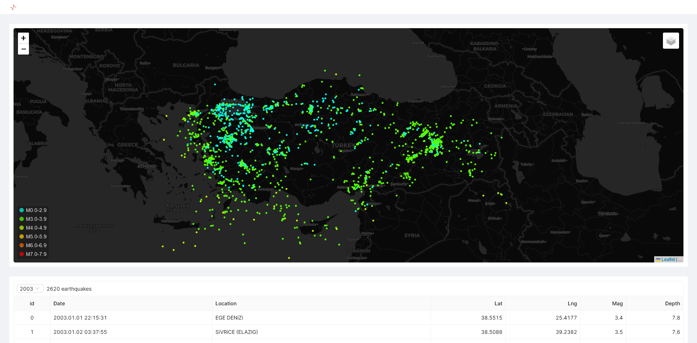

# Türkiye'deki Depremler

Bu küçük uygulama, 2003 yılından itibaren gerçekleşen depremleri Kandilli Rasathanesi'nin sitesinden çekip (yıllara göre ayırarak) JSON formatında kaydeder.

### Veri Formatı

```json
[
  {
    "id": 0,
    "date": "2003.01.01 22:15:31",
    "location": "EGE DENiZi",
    "lat": 38.5515,
    "lng": 25.4177,
    "mag": 3.4,
    "depth": 7.8
  },
  ...
]
```

### Amaç

Var olan bilgileri eğitimsel ve akademik çalışmalar için daha kolay kullanılabilir şekile dönüştürmek.

### Kullanım

```bash
  git clone https://github.com/ndrshn/depremler.git
  cd ./depremler
  python ./depremler.py
  cd ./viewer
  npm i
  npm run dev
```

Tarayıcınızda http://localhost:3000 adresini açın.

### Lisans

Tüm bilgiler T.C. Boğaziçi Üniversitesi Kandilli Rasathanesi ve Deprem Araştırma Enstitüsü'ne aittir.

[Kaynak](http://www.koeri.boun.edu.tr/scripts/lst9.asp)

# Earhquakes Between 2003-2022 in Türkiye

This app pulls earthquakes since 2003 from the Kandilli Observatory website and saves them in JSON format (separated by year).

### Data Format

```json
[
  {
    "id": 0,
    "date": "2003.01.01 22:15:31",
    "location": "EGE DENiZi",
    "lat": 38.5515,
    "lng": 25.4177,
    "mag": 3.4,
    "depth": 7.8
  },
  ...
]
```

### Purpose

To convert existing information to more easily available ways for educational and academic studies.

### Usage

```bash
  git clone https://github.com/ndrshn/depremler.git
  cd ./depremler
  python ./depremler.py
  cd ./viewer
  npm i
  npm run dev
```

Open http://localhost:3000 in your browser.

### Licence

All Information belongs to Kandilli Observatory and Earthquake Research Institute of Boğaziçi University.

[Source](http://www.koeri.boun.edu.tr/scripts/lasteq.asp)
